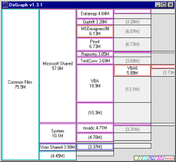



## DirGraph

### Description

Draws a graphics view of the disc space usage on your drives, directories and network shares. Allows the user to navigate around the view to get zoomed-in or out viewsof the data. Useful for trying to find why that 12Gb partition is suddernly so full...

For more info, including a tutorial, see http://www.spillett.net/DirGraph/
 
### More Info
 
Any VB programmer should be able to work out what is going on!

             |
---                |---
**Submitted On**   |2001-08-20 12:40:56
**By**             |[David James Spillett](https://github.com/Planet-Source-Code/PSCIndex/blob/master/ByAuthor/david-james-spillett.md)
**Level**          |Intermediate
**User Rating**    |4.9 (68 globes from 14 users)
**Compatibility**  |VB 6\.0
**Category**       |[Complete Applications](https://github.com/Planet-Source-Code/PSCIndex/blob/master/ByCategory/complete-applications__1-27.md)
**World**          |[Visual Basic](https://github.com/Planet-Source-Code/PSCIndex/blob/master/ByWorld/visual-basic.md)
**Archive File**   |[DirGraph249778202001\.zip](https://github.com/Planet-Source-Code/david-james-spillett-dirgraph__1-26403/archive/master.zip)

